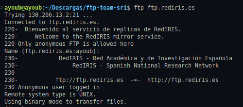
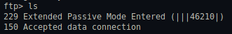
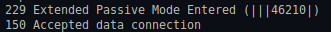
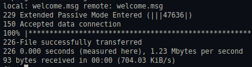
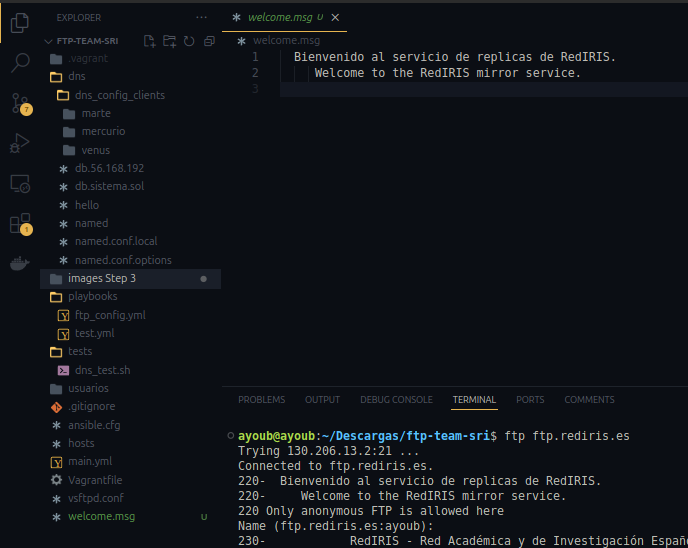

# 🎨 Uso de un Cliente Gráfico de FTP

Este documento explica cómo utilizar un cliente gráfico de FTP para conectarse a un servidor, explorar archivos y transferir datos.

---

## 📌 Pasos a Seguir

### 1️⃣ Instala un Cliente FTP
En una máquina con entorno gráfico, instala un cliente de FTP, como:
- **FileZilla**
- **gFTP**
- **WinSCP**
- **FTP Voyager**
- **CrossFTP**

---

### 2️⃣ Conéctate al Servidor `ftp.rediris.es`

Inicia la aplicación y crea una conexión anónima al sitio `ftp.rediris.es`.

---

### 3️⃣ Examina los Mensajes Intercambiados

Responde a las siguientes preguntas:

🔹 **a. ¿Qué modo ha usado el cliente (activo o pasivo) al descargar el listado de archivos del servidor?**
   - Se está utilizando el **modo pasivo**.

     

🔹 **b. ¿Cuál es la IP del servidor `ftp.rediris.es`?**
   - La dirección IP de `ftp.rediris.es` es **130.206.13.2/21**.

     

🔹 **c. ¿Qué significan los dos últimos dígitos en el mensaje `227 Entering Passive Mode (…)`?**
   - Se utilizan para calcular el **puerto de conexión**.

     

---

### 4️⃣ Descarga un Archivo desde el Servidor

Descarga el archivo **`welcome.msg`** a la carpeta de documentos del usuario.

---

## 📜 Licencia
Este proyecto está licenciado bajo la **MIT License**. Consulta el archivo [LICENSE](LICENSE) para más información.

---

👥 **Autores:** dlopmal873@ieszaidinvergeles.org, aelh9070@ieszaidinvergeles.org
