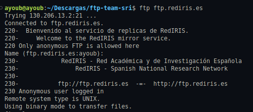
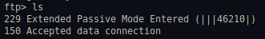
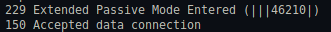
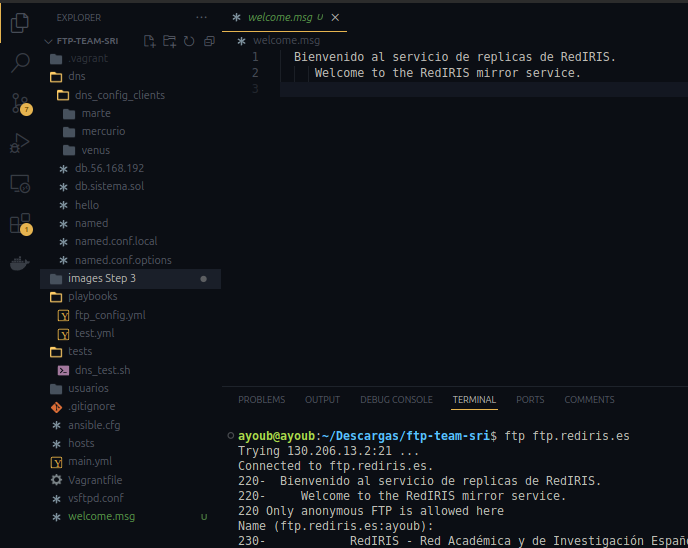

## 3. Uso de un cliente gráfico de FTP

#### 1. En una máquina con modo gráfico instala un cliente de FTP, por ejemplo Filezilla, gFTP, WinSCPi, FTP Voyager o Cross FTP.

---

#### 2. Inicia la aplicación y crea una conexión anónima al sitio ftp.rediris.es

---

#### 3. Examina la ventana de los mensajes intercambiados y contesta:

- **a. ¿Qué modo ha usado el cliente (activo o pasivo) al descargar el listado de archivos del servidor?**
    - Esta usando el pasivo.

        

- **b. ¿Cuál es la IP del servidor de ftp.rediris.es?**
    -   La IP de ftp.rediris.es es 130.206.13.2/21

        

- **c. ¿De los 6 dígitos que aparecen en el mensaje 227 Entering Passive Mode (…) qué significan los 2 últimos números?**
    - Los dos ultimos numeros se utilizan para calcular el puerto.

        

---

### 4. Descarga el archivo welcome.msg sobre la carpeta de documentos del usuario.

***Authors dlopmal873@ieszaidinvergeles.org, aelh9070@ieszaidinvergeles.org***