# 🚀 Proyecto FTP: Uso del Cliente FTP en Línea de Comandos

Este documento detalla los pasos para conectarse y operar con un servidor FTP desde la línea de comandos.

---

## 📌 Pasos a Seguir

### 1️⃣ Inicia sesión en la máquina `tierra` con la cuenta `pepe`
Si la cuenta no existe, créala con el siguiente comando:

```bash
sudo adduser pepe
```

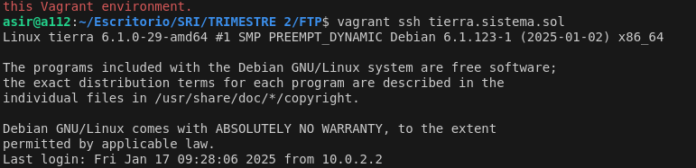
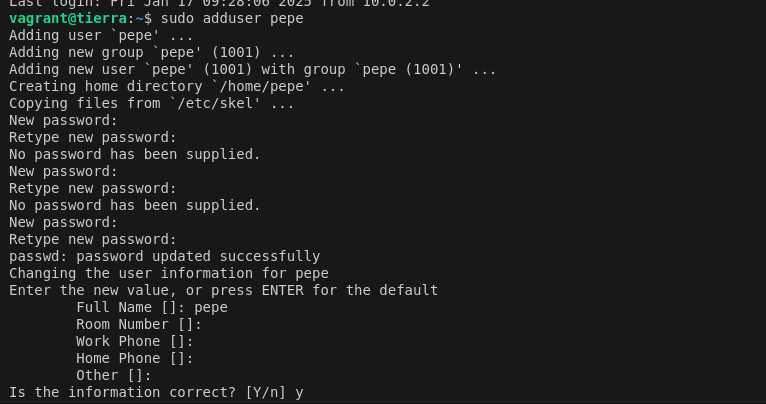

---

### 2️⃣ Crea el directorio `/home/pepe/pruebasFTP` y accede a él

```bash
mkdir -p /home/pepe/pruebasFTP
cd /home/pepe/pruebasFTP
```

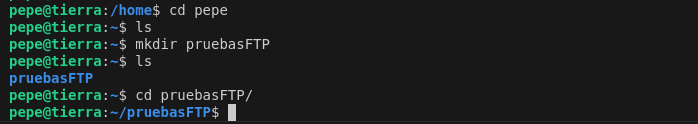

---

### 3️⃣ Crea el archivo `datos1.txt` dentro del directorio `pruebasFTP`

```bash
echo "Este es el contenido de datos1.txt" > datos1.txt
```


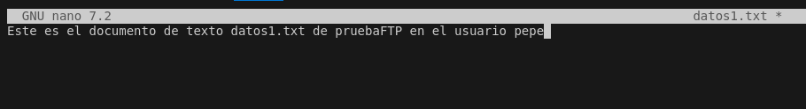

---

### 4️⃣ Conéctate al servidor FTP `ftp.cica.es` usando `pftp`

```bash
pftp ftp.cica.es
```

Cuando se soliciten credenciales:
- **Usuario:** `anonymous`
- **Contraseña:** Tu dirección de correo electrónico o simplemente presiona `Enter`.

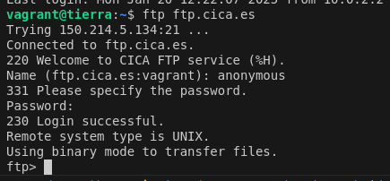

---

### 5️⃣ Verifica el directorio actual en el servidor

```bash
pwd
```

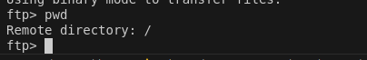

---

### 6️⃣ Verifica el directorio actual en el cliente

```bash
lpwd
```

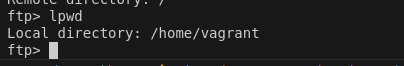

---

### 7️⃣ Lista los archivos en el servidor

```bash
ls
```

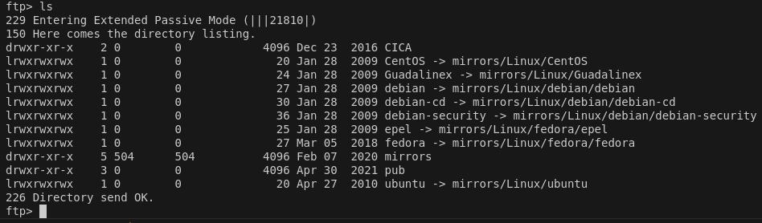

---

### 8️⃣ Lista los archivos en el cliente

```bash
!ls
```
*(En Windows, usa `!dir` en lugar de `!ls`.)*

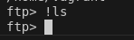

---

### 9️⃣ Descarga el archivo `/pub/check` del servidor

```bash
get /pub/check
```

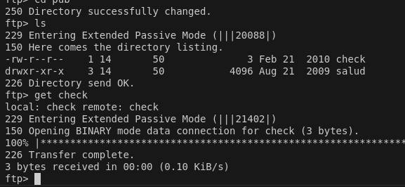

---

### 🔟 Verifica la descarga del archivo

```bash
!ls
```

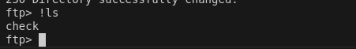

---

### 1️⃣1️⃣ Crea el directorio `imágenes` dentro de `pruebasFTP` en el servidor

```bash
mkdir pruebasFTP/imágenes
```

Verifica la creación con:

```bash
ls pruebasFTP
```


---

### 1️⃣2️⃣ Sube el archivo `datos1.txt` al servidor

```bash
put datos1.txt pruebasFTP/datos1.txt
```

Si aparece un error `550 Permission denied`, significa que no tienes permisos de escritura en el servidor.


---

### 1️⃣3️⃣ Cierra la conexión con el servidor

Para salir de la sesión FTP de manera segura, usa:

```bash
bye
```

O alternativamente:

```bash
quit
```

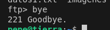

---

## 📜 Licencia
Este proyecto está licenciado bajo la **MIT License**. Consulta el archivo [LICENSE](LICENSE) para más información.

